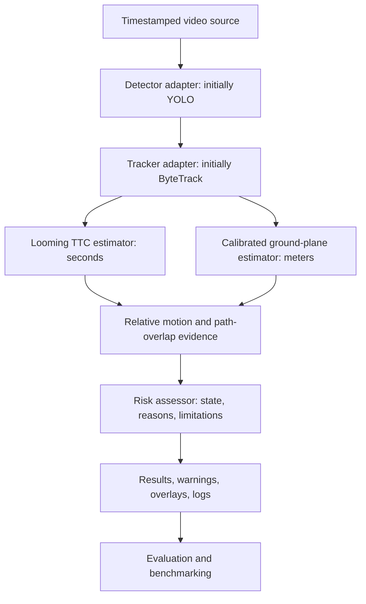

# Architecture and scientific contracts

The target is one offline process with small replaceable adapters and independent
numerical logic. Phase 1 introduces timestamped video, a detector adapter,
immutable observations and streamed run output. Tracking and later numerical
components remain gated by the [implementation plan](detection-tracking-plan.md).

## Dependency boundaries

- Entry points orchestrate adapters and domain values.
- Adapters translate video, detector, and tracker outputs into explicit contracts.
- Domain contracts and pure estimation/risk functions must not import YOLO,
  OpenCV UI, or GPU libraries.
- Video reading preserves timestamps and does not choose alert policy.
- Visualization renders results; it does not compute risk or replace unknown
  evidence with a safe state.
- Evaluation consumes outputs and run metadata with declared reference labels.

Introduce `domain/`, `io/`, `detection/`, `tracking/`, `estimation/`, `risk/`,
`viz/`, and `evaluation/` when real implementations need them. No empty interface
hierarchy or plugin framework is required for the foundation.

## Contracts to introduce with their first consumers

| Contract | Meaning and validity rules |
| --- | --- |
| Frame | Source ID, frame index, source presentation timestamp in seconds, dimensions, explicit BGR/RGB payload |
| Detection | Class, score, source frame, finite `xyxy` pixel box with documented bounds policy |
| Track | Identity, timestamped history, age/quality; invalidate derived motion on identity changes and long gaps |
| Estimate | Optional value, unit, method, validity, evidence; unavailable is not zero |
| RelativeState | Camera-frame lateral X and longitudinal Z in meters, velocities in m/s; publish only under valid calibration assumptions |
| RiskAssessment | Track ID; UNKNOWN, NO_CURRENT_WARNING, or WARNING; TTC/path evidence, reasons, limitations |
| RunMetadata | Configuration, source hash, model version/checksum/license, code commit, environment, timing |

Motion uses source time, not processing wall-clock time. Pixels, seconds, meters,
and coordinate frames must remain explicit at component boundaries. Confidence
scores must not be relabeled as physical collision probabilities.

## Measurement constraints

Looming `TTC ≈ s / ds_dt` is a depth-closure proxy under stable object size,
orientation, projection, and dominant approach motion. Non-expansion, occlusion,
noisy derivatives, or insufficient history yield unavailable evidence. TTC does
not prove that future paths intersect.

Metric ground position requires documented intrinsics, camera installation
height/pitch, a suitable road plane, and a valid contact point. Near-horizon
projection, grades, camera motion, and missing contact points can invalidate it.
Uncalibrated image-scale measurements must not be labeled meters.

Warnings will combine motion/path evidence and measurement validity. Turns,
cut-ins, rotations, missed detections, and identity switches need explicit tests
and limitations. Thresholds and latency targets remain unvalidated until measured.

See [HANDOFF.md](../HANDOFF.md) for the gated roadmap and evaluation plan, and
[ADR-0001](adr/0001-repository-foundation.md) for foundation choices.

The standalone [evaluation plan](evaluation-plan.md),
[data conventions](../data/README.md), and [model conventions](../models/README.md)
define the evidence and provenance requirements. The owner authorized detection
and tracking on 2026-10-05. [ADR-0002](adr/0002-video-detection.md) records the first
feature boundaries and timestamp policy.
